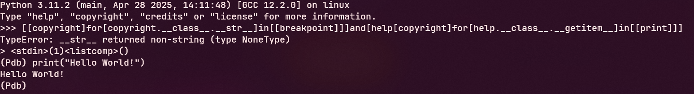

Pyjails are a type of puzzle where an author creates a restricted python environment, where the goal is to escape the sandbox and get code execution. An archive of some pyjails can be found at this [link](https://github.com/jailctf/pyjail-collection). In late 2025, I tried my hand at one of these pyjails to gain a better understanding of python's internal mechanisms.

The pyjail (named impossible) was only a single line:
```py
#!/usr/local/bin/python3
eval(''.join(c for c in input('> ') if c in "abcdefghijklmnopqrstuvwxyz:_.[]"))
```

In this pyjail, it allows us to send a string of arbitrary length provided that it is in the characterset "abcdefghijklmnopqrstuvwxyz:_.[]". This is problematic because in python, you need the `()` to call any sort of function. Our first attempt was the following string: `[obj["print('hi')"] for obj.__class__.__getitem__ in [eval]]`. Basically, this overwrites the getitem dunder method of obj and replaces it with eval, meaning that when the list comprehension attempts to access the `print('hi')` method, it executes that code instead. This has the obvious two problems of using parentheses and spaces which are both blacklisted characters. After some reworking, I found that you actually don't need spaces to separate tokens in python so long as you have another character separating the two. This led to the payload `[[license]for[license._Printer__setup]in[[breakpoint]]]and[help[license]for[help.__class__.__getitem__]in[[print]]]`. Since we have the `[]` wrapping what used to be separated by space, we have to use double brackets in the list element we are iterating over. I didn't really think through the logic behind it but it seemed to work so I was satisfied with that. Now, the only thing standing in the way was the pesky uppercase P. To remedy this, I used python's copyright instead of license which was lowercase. This leads to our final payload: `[[copyright]for[copyright.__class__.__str__]in[[breakpoint]]]and[help[copyright]for[help.__class__.__getitem__]in[[print]]]`. In short, it's a two stage payload that first replaces the str dunder method of copyright with `breakpoint`, which means that when we try to convert copyright to a string, it will actually call `breakpoint()`, a python method that allows us to inspect python state and also run any python commands! The second method just calls `print(copyright)` which pops our shell.
